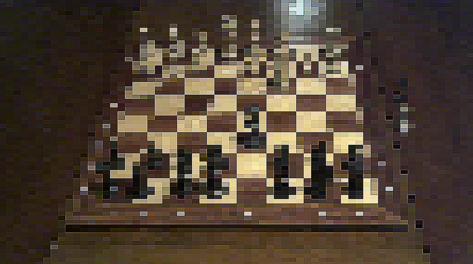
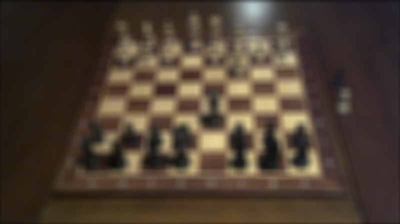
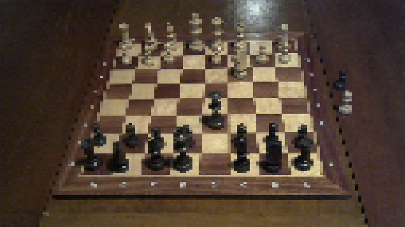
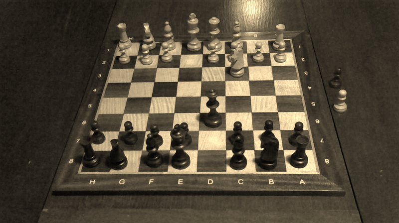
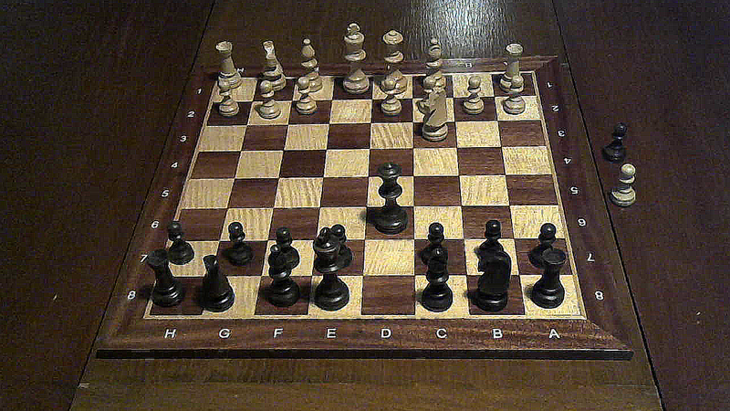
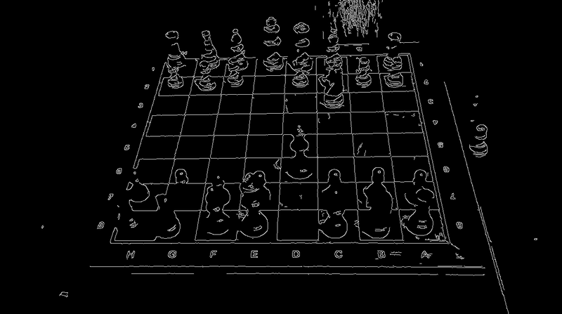
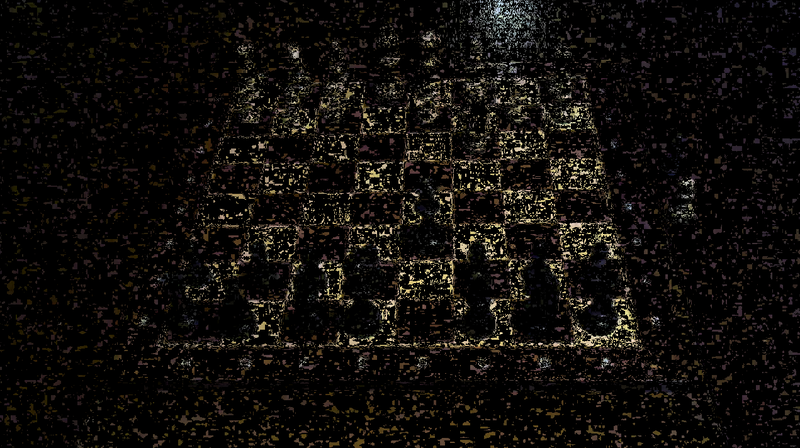

# Instacam

**Filters for your webcam**

This is a pet project motivated mostly by my desire to learn both [Rust](https://www.rust-lang.org/) and [FFmpeg](https://ffmpeg.org/)

It grabs an input video feed (most likely your original webcam, but any video
source should work, in theory), and outputs a transformed video feed.


## Prerequisites

You need to create a virtual camera device on your system. Currently, I only
know how to do this on Linux (instructions below).

If an equivalent tool exists for other systems, there should be no other major blockers to getting this to work
(both FFmpeg and Rust are widely available in most systems).

### Linux

Setup [v4l2loopback](https://github.com/umlaeute/v4l2loopback), and create
a virtual webcam, such as:

```sh
sudo modprobe v4l2loopback devices=1 video_nr=2 card_label="Instacam" exclusive_caps=1
```

On my machine, this creates a `/dev/video2` device. Depending on how many you
already have, yours might be named differently.

## Setup

1. Clone the repo

```sh
# clone the repo
git clone https://github.com/naps62/instacam.git
cd instacam
```

2. Create a configuration file under `~/.config/instacam/config.json` (changing
   each value acording to your system):

```
{
  "input": "/dev/video0",
  "output": "/dev/video2",
  "width": 1280,
  "height": 720,
  "fps": 30,
  "pipeline": [
    {
      "name": "preview"
    }
  ]
}
```

3. Start the program:

```sh
cargo run
```

## Using filters

After the initial setup, filters are configured mostly through the `pipeline` of
the config file. You can compose the multiple existing filters, and the final
image will be output to your `output` device.

For instance, the following pipeline:

```
"pipeline": [
  {
    "name": "pixelate",
    "k": 64
  },
  {
    "name": "sharpen"
  },
  {
    "name": "preview"
  }
]
```




### Available filters

#### Preview

Does not alter the image, but renders the current frame in
a window, allow you to see the result in different stages of the pipeline.

```
"pipeline": [
  {
    "name": "preview",
  }
]
```


#### Blur

Blurs the image by a given factor

```
"pipeline": [
  {
    "name": "blur",
    "k": 32
  }
]
```



#### Pixelate

Pixelates the image. `k` here is maximum desired number of pixels per
line.

```
"pipeline": [
  {
    "name": "pixelate",
    "k": 128
  }
]
```



#### Sepia

```
"pipeline": [
  {
    "name": "sepia"
  }
]
```



#### Sharpen

```
"pipeline": [
  {
    "name": "sharpen"
  }
]
```



#### Edge Detection

Mostly an experimental filter I was playing with, while learning more about the
OpenCV API

```
"pipeline": [
  {
    "name": "edges",
    "t1": 100,
    "t2": 200
  }
]
```



#### Background Subtraction

Also an experimental filter, with a background subtractor algorithm. This sample
image is hurt by my low-quality webcam, as well as the lack of a more prominent
foreground in this picture.

```
"pipeline": [
  {
    "name": "bgsub"
  }
]
```



# About

Instacam was authored by [Miguel Palhas](http://naps62.com).

The project is fully open-source. Use it as you wish.
